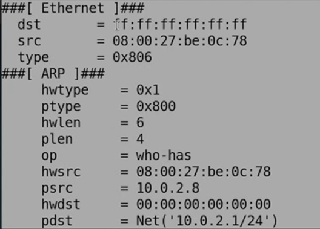
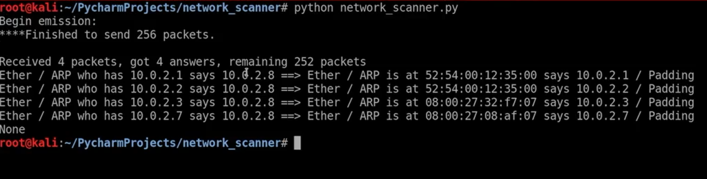
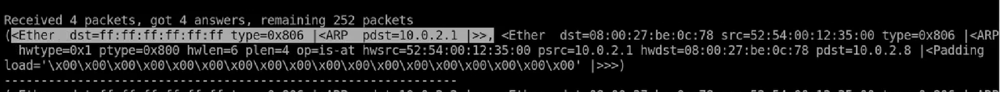
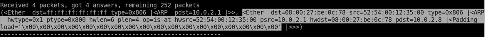
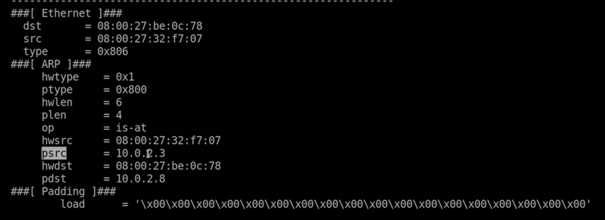
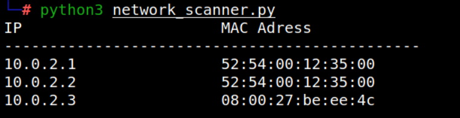

## Project title: Network Scanner
## Project Description: A network scanner based on ARP request protocol, to obtain all the IP and MAC addresses within the near network 


### Used Algorithm 


1. Create an ARP request directed to the broadcast MAC address asking for a specific IP address
2. Send packet and receive response
3. Parse the response
4. Print result

#### 1 -> Create an ARP request
**ARP** stands for **Address Resolution Protocol** and is a communication protocol used for discovering the link layer address, such as a MAC address, associated with a given internet layer address, an IPv4 address.
Using the ARP protocol, I can easily link MAC addresses to IP addresses.
For example, device A will send the broacast to all the clients on the network saying "who has <a specific IP address>", this packet is going to be directed to the broadcast MAC address.
  


All the devices will ignore the packet except for the one with the specific IP address.
This device will send an ARP response with a confirmation about the broadcast address and the MAC address.
I used Scapy library to create an ARP request, an ARP packet object, more information is shown here: [https://scapy.readthedocs.io/en/latest/usage.html?highlight=arp#](url)
```
  arp_request = scapy.ARP(pdst = ip) -> creating an ARP request
``` 
**The broadcast Mac Address** is a virtual MAC address, something that doesn't exist really, but if I send something to it, all clients from the network will receive it.
I need to use an internet frame because data in network is sent using the MAC address, not the IP address, the MAC address is a physical address that is engraved on each network card. The source MAC and the destination MAC is set in the internet part of each packet.
I created an ethernet frame (sent to the broadcast MAC address), and then append our ARP request to it later on
```
  broadcast = scapy.Ether()
  ``` 
 Broadcast is an Ether object from the Ether class within the scapy module, I make sure that the packet is sent to the broadcast MAC address and not to only one device
```  
scapy.ls(scapy.Ether) -> a list with all the fields I can use
dst = the MAC address of the broadcast
 ``` 

I need to combine the 2 packets, so I have to use "/"
 ```  
arp_request_broadcast = broadcast/arp_request 
   ```
   ```
.show() -> showing details of each packet
   ```


  
  
  #### 2 -> Send packet and receive response

I used the ```.srp()  ``` function, is going to send-receive packets with a custom ether part.
The return value is  a couple of two lists(2 values, 2 variables).
- Answered packets
- Unanswered packets
  
By setting the destination MAC address(dst = "ff:ff:ff:ff:ff:ff"), I added a new layer, this is the location where the packet goes.
I need to set a timeout, if I don't get a response for the request, it will wait one second and then it will move on, if I don't use this, I never get out from the program.
The first part is the request that we sent, in the second is the response from the MAC address

 


#### 3 -> Parse the response


I want to be able to do something else with the information, to use the MAC address to do further attacks, to be able to access the MAC address variable.
I created a custom function instead of using the summary function provided by the **scapy** library(module)
I had to parse 'answered'.
The answered list contains a smaller list, a couple(packet sent, aswer)
- packet sent -> first element
  
- answer -> next element
  
If I have a packet object, I need to use  ```.show() ``` to see all the field withing that packet.

 ```psrc -> clients IP address, source ip that the packet was sent from ```
  
  ```hwsrc ->the hardware source, the MAC address of the client that send the packet back to us ```

#### 4 -> Print result

Trying to implement the "Net Discover" way of showing the MAC and IP(responses)
  

